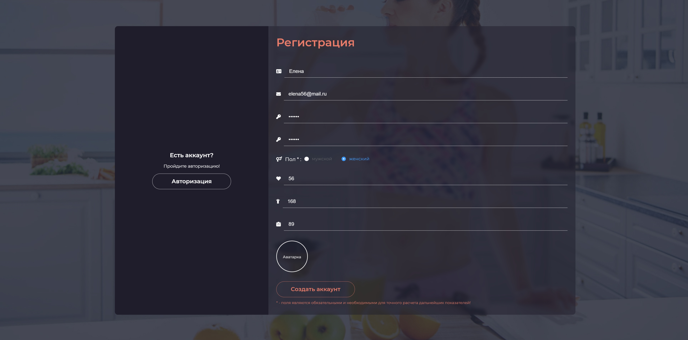
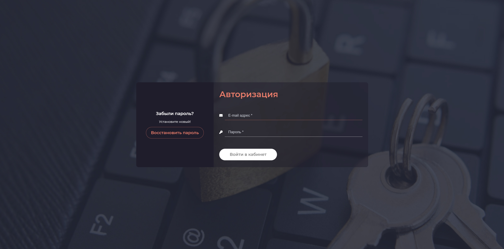
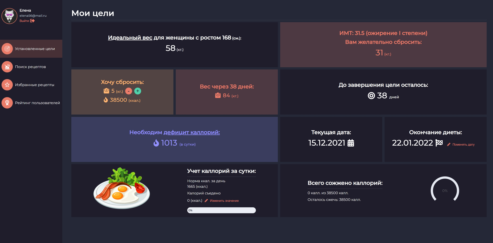
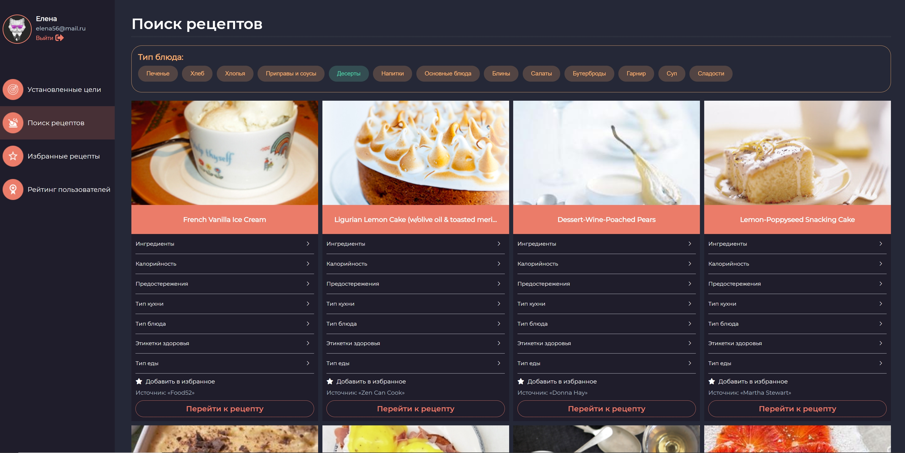
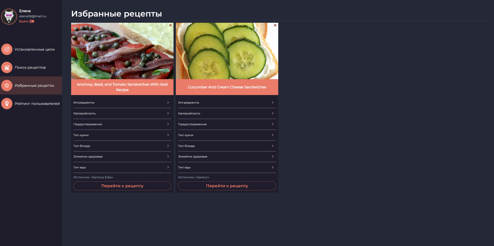
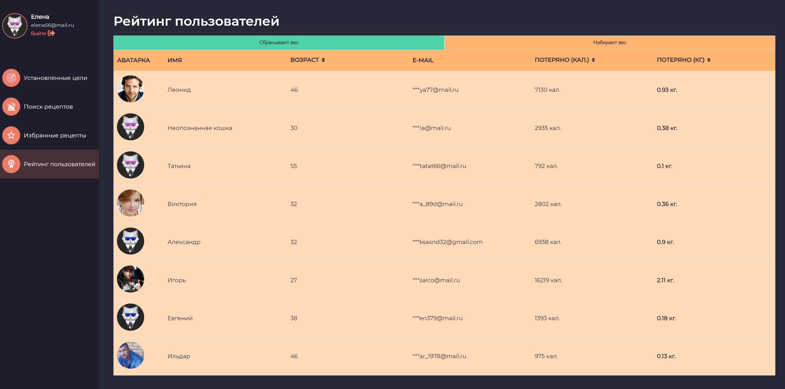
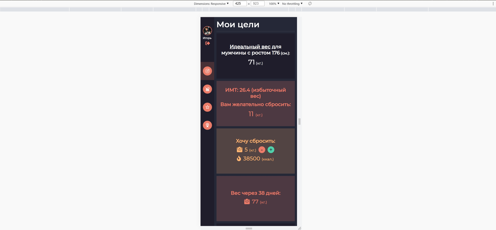

# control-food-main


Create a personal account in our service and keep track of your diet and weight!

## Technologies used :computer:

:heavy_check_mark: [vue](https://vuejs.org/) \
:heavy_check_mark: [vuelidate](https://vuelidate.js.org/) \
:heavy_check_mark: [element-ui](https://element.eleme.io/#/en-US) \
:heavy_check_mark: [firebase](https://firebase.google.com/)
### Main screen


### Registration form with validation



### Authorization form


### The ability to reset your password


### A page with user goals.


### Search for recipes, selection by type of food


### Favorite user recipes


### User rating (for gaining and losing weight)


### Adaptation for all devices


### The page for handling invalid paths


To view a live example, :point_right:[click here](https://salco2012.github.io/control-food-main/)

## Authors

- **Igor Solodovnick** - https://github.com/salco2012

---

## Project setup

```
npm install
```

#### Compiles and hot-reloads for development

```
npm run serve
```

### Compiles and minifies for production

```
npm run build
```

### Lints and fixes files

```
npm run lint
```